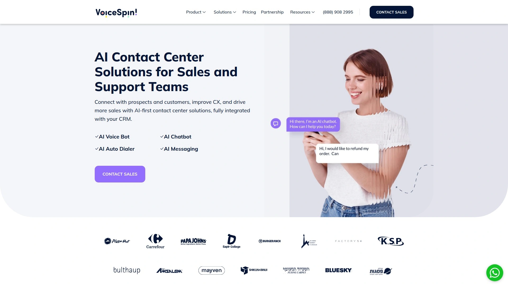
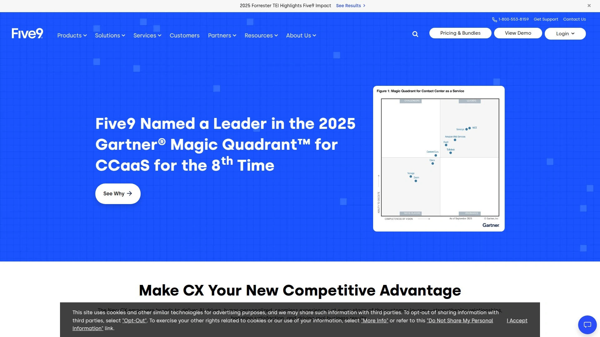
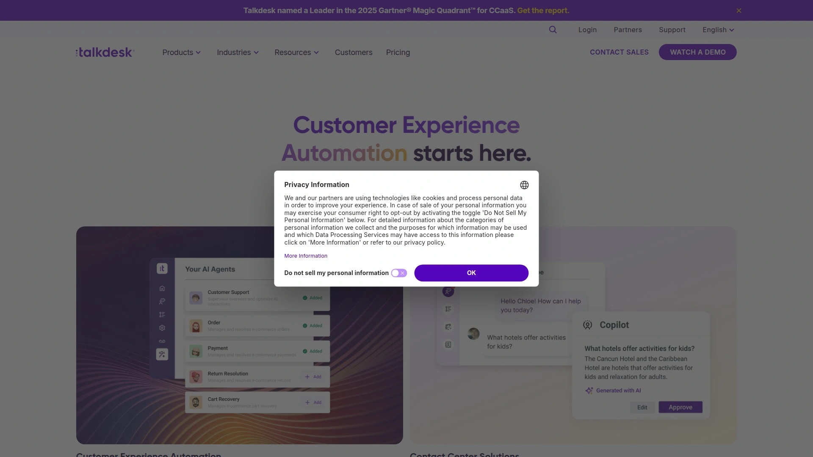
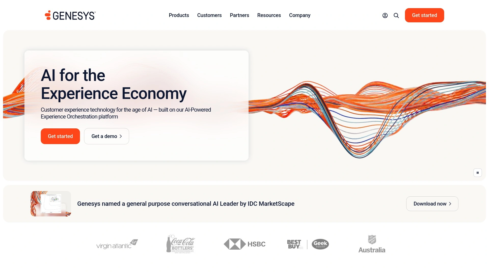
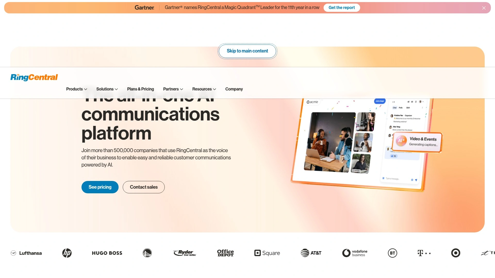
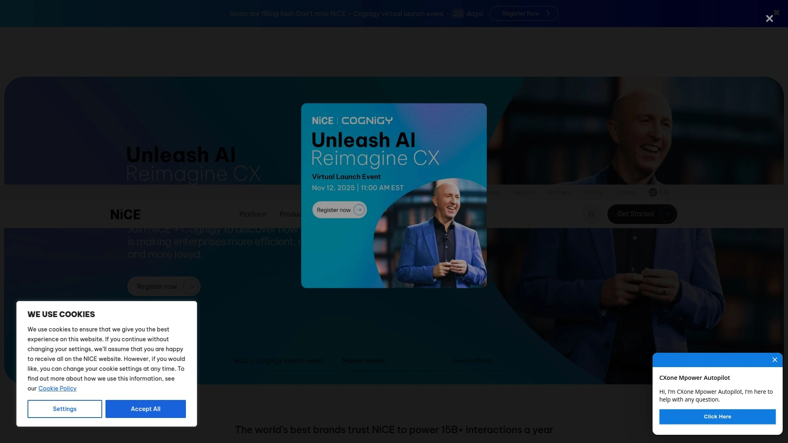
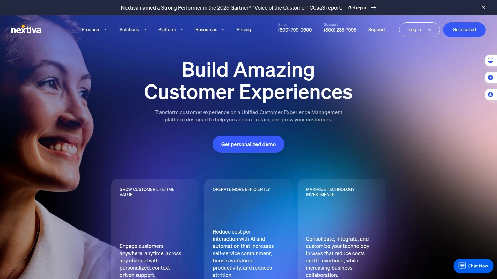
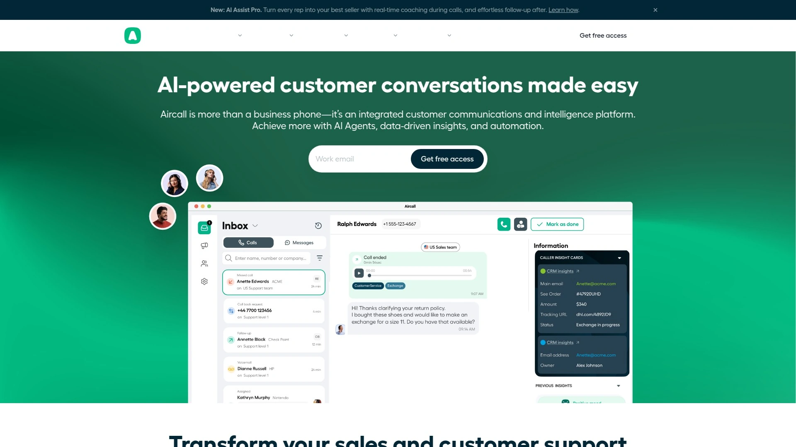
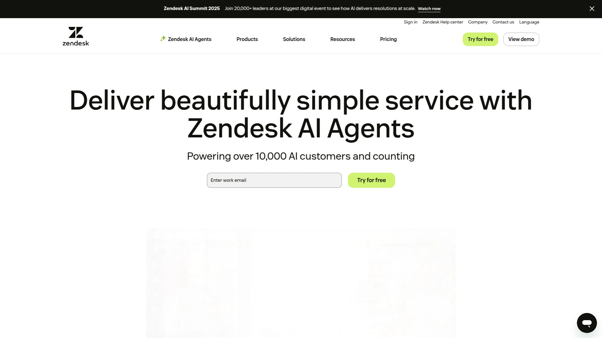
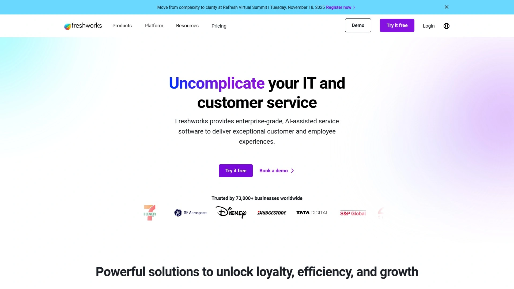

# 2025's Top 10 Best Cloud Contact Center Platforms

Running a contact center used to mean installing server racks, hiring IT teams to babysit your phone system, and praying nothing breaks during peak call volume. Cloud contact center platforms changed that completely—now businesses spin up omnichannel communication systems in days instead of months, scale agents up or down based on demand without hardware headaches, and access AI-powered features that would've cost six figures just a few years ago. The challenge isn't finding cloud contact center options anymore—it's figuring out which platforms deliver reliable call quality, intelligent routing that actually works, and pricing models that don't punish you for success.

What separates platforms that transform customer experience from those that create new frustrations comes down to uptime reliability when every dropped call costs revenue, integration depth with your existing CRM and business tools, and whether AI features genuinely improve agent productivity or just sound impressive in demos. These platforms handle everything from basic inbound support through complex omnichannel orchestration across voice, chat, email, and social media without requiring dedicated DevOps teams.

## **[VoiceSpin](https://www.voicespin.com)**

AI-powered contact center that doesn't require enterprise budgets.

VoiceSpin delivers comprehensive cloud contact center capabilities starting at price points that make sense for growing businesses rather than just Fortune 500 companies. The platform combines automatic call distribution, intelligent routing, interactive voice response, and omnichannel communication into one unified agent workspace. What makes this work for real operations is how VoiceSpin handles the complexity behind simple interfaces—agents access voice, SMS, email, chat, and WhatsApp conversations from a single panel without juggling multiple applications.

The **AI speech analytics** monitors 100% of calls in real-time rather than sampling, catching quality issues, compliance risks, and coaching opportunities that manual monitoring misses. Sentiment detection flags frustrated customers automatically so supervisors can intervene before situations escalate. Call transcription happens live, populating CRM fields and generating summaries without agents spending post-call time on documentation.

**Power dialer functionality** for outbound teams eliminates manual dialing downtime, automatically moving through contact lists while agents focus on actual conversations. Preview dialing shows contact information before connecting, giving agents context for personalized outreach. Predictive algorithms determine optimal dialing pace based on agent availability and connection rates, maximizing productive talk time.

Custom roles and permissions create secure access appropriate for agents, supervisors, and administrators without exposing sensitive information unnecessarily. Rules engine automates workflows like routing specific customer segments to specialized agents or triggering follow-up tasks based on call outcomes. The entities framework lets businesses define custom data structures matching their specific operations rather than forcing processes into rigid templates.

**CRM integration** with HubSpot, Salesforce, and other platforms syncs contact information bidirectionally, eliminating duplicate data entry and keeping customer records current. Click-to-dial from CRM interfaces streamlines workflows while automatically logging call details back to customer records. Screen pops surface relevant customer history when calls arrive, giving agents immediate context.

Real-time reporting dashboards track KPIs like average handle time, first-call resolution, and queue wait times without requiring analysts to build complex reports. Managers access live agent status, monitor active calls, and view performance trends through intuitive visualizations. Historical analytics identify patterns in call volume, agent performance, and customer issues to inform staffing and training decisions.

**Pricing transparency** starts at accessible monthly rates per agent with clear feature inclusions, avoiding the enterprise software pattern of "contact us for pricing" that hides actual costs. Free trials let teams test functionality with real operations before committing budgets. The platform scales smoothly as businesses grow without requiring contract renegotiations or architecture changes.

**Best applications:** Growing businesses needing enterprise features without enterprise complexity, sales teams wanting integrated outbound dialing and CRM sync, support centers requiring omnichannel capabilities, companies prioritizing AI-powered quality monitoring and analytics.

## **[Five9](https://www.five9.com)**

Enterprise-grade AI and automation for high-volume operations.

Five9 earned its position as a leading contact center platform by focusing on collaborative intelligence—combining human agents with AI and automation to maximize productivity. The platform handles massive call volumes reliably through cloud-native architecture built on robust infrastructure. Forrester's Total Economic Impact study found organizations achieve significant ROI from deploying Five9, driven by efficiency gains and reduced operational costs.

**Intelligent Virtual Agent** handles routine customer inquiries through conversational AI, deflecting simple requests from human agents so they focus on complex issues requiring judgment and empathy. The system understands natural language, extracts intent, and completes transactions or provides information without agent involvement. When automation reaches its limits, seamless handoffs to human agents include full conversation context.

**Agent Assist** provides real-time coaching during live calls, surfacing relevant knowledge articles, suggesting responses, and flagging compliance concerns as conversations unfold. This AI layer makes every agent perform like your best agent by democratizing expertise across the team. New hires ramp faster when technology compensates for experience gaps during early calls.

Workforce optimization tools forecast staffing needs based on historical patterns and anticipated demand, generating schedules that match agent availability with predicted call volume. Real-time adherence monitoring shows when agents deviate from schedules, while advanced analytics identify training opportunities and performance trends. Quality management workflows streamline evaluation processes and feedback loops.

**Omnichannel capabilities** let customers choose their preferred communication method—voice, email, chat, SMS, social messaging—while maintaining conversation continuity across channel switches. Agents manage all interactions through the unified Agent Desktop Plus interface, eliminating the cognitive load of switching between disparate tools. Historical context follows customers regardless of how they reach out.

CRM integrations with Salesforce, Microsoft Dynamics, Oracle, Zendesk, and NetSuite embed Five9 functionality directly in existing workflows. Screen pops deliver customer information from CRM systems as calls arrive, while automatic activity logging captures interactions without manual data entry. Custom integrations through REST APIs extend functionality to proprietary systems.

**Implementation support** includes professional services teams that guide deployment, configuration, and optimization. While this enterprise approach ensures successful rollouts, it does mean longer setup timelines compared to self-service platforms. Organizations get tailored solutions matching their specific requirements rather than one-size-fits-all configurations.

**Target organizations:** Large enterprises handling high call volumes, companies requiring sophisticated workforce management, businesses committed to AI-driven customer service transformation, contact centers needing proven scalability and reliability.

## **[Talkdesk](https://www.talkdesk.com)**

Cloud-native platform built for speed and innovation.

Talkdesk combines enterprise-grade capabilities with modern user experience that doesn't require extensive training. The platform's microservices architecture enables rapid feature deployment and flexible configuration matching diverse business needs. Organizations in 100+ countries rely on Talkdesk for mission-critical customer communications, proving global scalability and reliability.

**Multi-Agent Orchestration** coordinates specialized AI agents across customer-facing and operational layers, with each agent trained for specific functions. This orchestrated system handles complex scenarios by routing tasks to the most appropriate AI or human resource automatically. The approach discovers opportunities, builds workflows, measures outcomes, and continuously optimizes for better results.

**Talkdesk Builder** empowers users to customize the platform through low-code, no-code, and traditional development tools without requiring dedicated engineering resources. APIs and SDKs enable deep integrations while visual interfaces let non-technical users configure routing logic, design agent workspaces, and build custom reports. This flexibility accommodates unique requirements without vendor dependency for every modification.

The **AppConnect marketplace** provides 100+ pre-built integrations covering CRMs, workforce optimization tools, quality management systems, and specialized industry applications. One-click installation reduces implementation friction while certified partnerships ensure compatibility and support. Organizations access best-of-breed tools rather than accepting limitations of monolithic platforms.

**Global Communications Network** delivers industry-leading call quality and reliability through strategically distributed data centers and optimized routing. The architecture supports BYOC (bring your own carrier) for organizations wanting to leverage existing telephony investments or meet specific carrier requirements. Hybrid cloud deployment options balance performance, compliance, and cost considerations.

Customer experience analytics transform conversation data into actionable insights through automated analysis of every interaction. Supervisors identify trends, track sentiment, and measure satisfaction without manual review of representative samples. Real-time dashboards surface issues requiring immediate attention while historical reports inform strategic improvements.

**Security certifications** including SOC 2/3, ISO 27001, PCI DSS Level 1, HIPAA, and GDPR compliance provide confidence for regulated industries. Multi-factor authentication, role-based access controls, and comprehensive audit logging protect sensitive customer data. Regular penetration testing and vulnerability assessments maintain security posture as threats evolve.

**Ideal scenarios:** Digital-first companies wanting modern user experience, enterprises requiring extensive customization, businesses needing certified security compliance, contact centers prioritizing innovation and rapid feature adoption.

## **[Genesys Cloud CX](https://www.genesys.com)**

True experience orchestration for sophisticated customer journeys.

Genesys Cloud CX delivers AI-powered experience orchestration that coordinates interactions across every touchpoint in the customer journey. The platform goes beyond routing calls to orchestrating multi-step experiences involving self-service, agent assistance, and backend systems. This holistic approach improves outcomes by considering complete customer context rather than treating each interaction in isolation.

**Single-tool flow builder** simplifies creation of complex orchestration logic that would require multiple specialized tools on other platforms. Designers map customer journeys visually, defining conditions, actions, and escalations without writing code. The system executes these flows consistently while adapting to real-time conditions like queue depths or customer sentiment.

**Event data platform** manages the complete data lifecycle from collection through storage, analysis, and activation. This foundation enables sophisticated analytics and AI capabilities by ensuring quality data feeds every system component. Organizations leverage event streams for real-time decisioning and batch analytics for strategic insights.

The microservices architecture provides massive scalability, handling traffic spikes gracefully without performance degradation. Redundant systems and geographic distribution ensure high availability, while rolling updates deploy new features without downtime. This technical foundation supports enterprise deployments serving millions of customers.

**Omnichannel capabilities** span voice, email, chat, SMS, social media, and messaging apps with intelligent routing that considers channel, customer value, issue complexity, and agent skills. Customers switch channels mid-journey without losing context or repeating information. Queue callbacks eliminate hold times by letting customers disconnect and receive return calls when agents become available.

Workforce engagement tools optimize scheduling, forecast demand, track adherence, evaluate quality, and gamify performance. Supervisors gain visibility into real-time operations while analysts dig into historical trends. The integrated approach eliminates data silos between workforce management and quality monitoring systems.

**API-first design** enables deep integration with enterprise systems, custom applications, and third-party tools. Pre-built connectors accelerate common integrations while webhooks and REST APIs support custom requirements. Development communities share implementations and best practices, reducing technical risk.

**Security and compliance** meet stringent enterprise requirements through comprehensive certifications, encryption standards, and access controls. Regular audits verify ongoing compliance rather than one-time certifications. Privacy controls help organizations meet regional data residency and protection requirements.

**Optimal for:** Large enterprises with complex customer journeys, organizations requiring sophisticated orchestration, businesses prioritizing advanced analytics, contact centers needing proven enterprise scalability.

## **[RingCentral Contact Center](https://www.ringcentral.com)**

Unified communications platform that actually unifies.

RingCentral differentiates by truly integrating contact center capabilities with broader business communications rather than treating customer service as isolated functionality. Organizations using RingEX for employee communications can add contact center features seamlessly, creating one platform spanning internal collaboration and customer engagement. This unified approach eliminates the integration challenges that plague organizations stitching together separate systems.

**Omnichannel support** handles voice, SMS, email, chat, and social media from a single agent interface that feels intuitive rather than overwhelming. Screen real estate optimizes around active conversations while keeping relevant customer data accessible. Keyboard shortcuts and click-to-dial functionality accelerate common actions without requiring mouse navigation.

**Intelligent routing** uses skills-based matching, customer priority, and current agent workload to connect inquiries with the most appropriate available resource. The system learns from outcomes, improving routing decisions over time. Administrators define routing logic through visual rule builders without requiring technical expertise.

Workforce optimization includes scheduling, real-time adherence monitoring, performance dashboards, and quality management workflows. Supervisors see agent status at a glance, listen to live calls, whisper coaching without customers hearing, or barge into conversations when necessary. This real-time visibility enables proactive management rather than reactive problem-solving.

**Speech analytics** transcribes calls automatically while detecting keywords, sentiment, and compliance phrases. Managers search conversation libraries for specific topics or phrases, finding training examples or quality issues without manual review. Trend analysis identifies recurring customer pain points or product issues requiring attention beyond individual case resolution.

CRM integrations with Salesforce, Microsoft Dynamics, and other platforms embed click-to-dial, screen pops, and automatic activity logging directly in familiar interfaces. Agents work in their CRM rather than switching between systems, reducing errors and cognitive load. Real-time data sync keeps information current across platforms.

**Reliability backed by 99.99% uptime SLA** provides confidence for mission-critical operations. Geographic redundancy and automatic failover prevent regional outages from disrupting service. The global carrier network optimizes call quality through intelligent routing and redundant pathways.

**Cloud-native architecture** built on AWS provides the scalability, security, and innovation velocity of modern infrastructure. Organizations avoid managing on-premises hardware while benefiting from continuous platform improvements. Rapid provisioning and deprovisioning supports seasonal scaling or business changes.

**Best matches:** Companies already using RingCentral for business communications, organizations wanting unified internal and external communication, businesses needing proven reliability, contact centers prioritizing ease of use.

## **[NICE CXone](https://www.nice.com)**

Enterprise platform for organizations demanding comprehensive capabilities.

NICE CXone delivers one of the most feature-rich contact center platforms available, serving large enterprises with complex requirements across multiple industries. The platform combines omnichannel routing, workforce optimization, quality management, analytics, and AI into an integrated suite. Organizations handling massive interaction volumes rely on CXone's proven scalability and reliability.

**Workforce engagement management** provides sophisticated forecasting, scheduling, adherence tracking, quality evaluation, and performance management through tightly integrated tools. The system optimizes staffing levels to balance service levels with labor costs while identifying coaching opportunities and skill gaps. Gamification features motivate agents through competitions, achievements, and recognition.

**Omnichannel routing** intelligently distributes voice, email, chat, SMS, social media, and messaging app interactions based on skills, availability, customer value, and business priorities. The routing engine considers multiple factors simultaneously, making optimal decisions in milliseconds. Self-learning algorithms improve routing effectiveness by analyzing outcomes and adjusting rules automatically.

Customer journey analytics reconstruct complete interaction histories across all touchpoints and channels, revealing pain points and opportunities invisible when analyzing individual contacts in isolation. Organizations identify where customers struggle, where processes fail, and where interventions deliver the highest impact. This holistic view informs strategic improvements rather than tactical fixes.

**AI and automation** capabilities include chatbots, virtual assistants, predictive routing, next-best-action recommendations, and automated quality evaluation. These AI applications reduce costs while improving outcomes by handling routine tasks and augmenting agent capabilities. The platform continuously learns from new interactions, becoming more effective over time.

Deep analytics provide operational, customer experience, and business insights through customizable dashboards and reports. Real-time metrics enable immediate response to emerging issues while historical analysis identifies trends. Role-based views surface relevant information for agents, supervisors, and executives without overwhelming them with unnecessary data.

**Security and compliance** meet requirements for regulated industries through certifications covering healthcare, financial services, and government sectors. Data encryption, access controls, audit logging, and incident response procedures protect sensitive information. Regular compliance audits verify ongoing adherence to standards.

**Implementation complexity** reflects the platform's comprehensiveness—organizations should expect significant configuration and training efforts. Professional services teams guide deployments while internal administrators require expertise to leverage full capabilities. The investment delivers results for enterprises with sophisticated requirements but may overwhelm simpler operations.

**Designed for:** Large enterprises with complex requirements, regulated industries needing comprehensive compliance, contact centers prioritizing workforce optimization, organizations requiring deep analytics.

## **[Nextiva](https://www.nextiva.com)**

All-in-one platform balancing capability with approachability.

Nextiva bridges the gap between simple phone systems and complex enterprise contact centers, delivering robust capabilities through user-friendly interfaces. The platform serves businesses from small teams through mid-market organizations with thousands of agents. Pricing transparency and flexible plans make Nextiva accessible without sacrificing functionality that growing businesses need.

**Contact center features** include automatic call distribution, interactive voice response, call recording, real-time monitoring, and detailed analytics at every pricing tier. Organizations access enterprise functionality without enterprise complexity or budgets. The platform scales smoothly as businesses grow, adding capabilities through simple upgrades rather than painful migrations.

**Omnichannel communication** spans voice, video, SMS, and team messaging through unified applications. Agents and employees use the same platform for customer interactions and internal collaboration, simplifying training and reducing tool sprawl. Mobile apps provide full functionality from smartphones, supporting flexible work arrangements.

Built-in CRM capabilities eliminate the need for separate customer management systems in organizations not already committed to major CRM platforms. The integrated approach keeps contact information, interaction history, and notes in one place without complex integrations. For businesses using Salesforce, HubSpot, or other CRMs, native integrations sync data bidirectionally.

**Auto attendant and IVR** systems provide professional call handling without hiring receptionists. Callers navigate menus using voice or keypad inputs, routing themselves to appropriate departments. After-hours modes, holiday schedules, and emergency overrides accommodate operational variations without administrator intervention.

Quality monitoring tools let supervisors evaluate calls, provide feedback, and track improvement over time. Call recording captures interactions for training, compliance, and dispute resolution. Scoring rubrics standardize evaluations while customizable forms accommodate different evaluation criteria across teams.

**Live-streamed performance dashboards** display real-time metrics on office screens or browsers, creating visibility and friendly competition. Agents see how their performance compares with team averages while managers spot issues requiring immediate attention. Historical reports track trends and measure progress toward goals.

Customer support from Nextiva receives consistent praise for responsiveness and expertise. The company employs support staff in-house rather than outsourcing, resulting in knowledgeable assistance that resolves issues rather than reading scripts. Live chat, phone, and email support ensure help is available when needed.

**Perfect for:** Growing businesses outgrowing basic phone systems, mid-market companies wanting comprehensive features, organizations prioritizing user-friendly design, businesses valuing responsive customer support.

## **[Aircall](https://aircall.io)**

Cloud phone system optimized for sales and support teams.

Aircall delivers cloud communications designed specifically for teams prioritizing simplicity and integration over extensive feature lists. The platform works particularly well for sales organizations, customer success teams, and support departments within larger companies rather than traditional high-volume contact centers. Setup happens quickly without technical expertise, letting teams start making calls within minutes.

**Integration ecosystem** spans 250+ business applications including Salesforce, HubSpot, Intercom, Slack, and Zendesk. These pre-built connectors sync contacts, log activities automatically, and enable click-to-dial from familiar interfaces. The depth of integration reduces friction that derails adoption with other platforms requiring custom development for basic connectivity.

**Power dialer** automates outbound calling for sales teams, eliminating manual dialing and maximizing time spent actually conversing with prospects. Agents work through contact lists efficiently while the system handles dialing, connection detection, and voicemail drop. Built-in local presence displays numbers matching prospect area codes, increasing answer rates.

The **SmartFlow editor** provides visual call routing configuration without requiring administrator training. Users drag and drop routing steps, building logic that directs calls based on time, caller ID, agent availability, or custom rules. Changes deploy immediately without development cycles or deployment windows.

**Aircall Workspace** unifies voice, text, voicemail, and WhatsApp into threaded conversations organized around customers rather than channels. Agents see complete communication history in one view, maintaining context regardless of how customers reach out. This organized approach reduces the chaos that overwhelms agents juggling multiple communication tools.

AI Voice Agent handles routine inbound inquiries with natural conversation abilities, managing FAQs and information gathering without human involvement. The autonomous agent operates 24/7, reducing after-hours missed calls while freeing human agents for complex issues. Seamless handoffs to human agents preserve context when AI reaches its limits.

**After-call work** time provides dedicated periods for agents to complete documentation, add notes, and schedule follow-ups without rushing between calls. This structured approach improves data quality while reducing agent stress. Automatic call tagging and note templates accelerate administrative tasks.

Aircall's mobile apps deliver full functionality from iOS and Android devices, supporting remote work and field operations. The same features available on desktop work on mobile, eliminating capability gaps between devices. Push notifications ensure agents never miss important calls regardless of location.

**Pricing transparency** includes clear per-user monthly costs without hidden fees or mandatory add-ons. Free trials let teams test functionality before committing budgets. While more expensive than basic VoIP services, the comprehensive features and superior user experience justify costs for teams prioritizing productivity.

**Target users:** Sales teams needing integrated dialing and CRM sync, customer success organizations, support departments within mid-market companies, remote teams requiring mobile-friendly functionality.

## **[Zendesk Talk](https://www.zendesk.com)**

Voice channel that completes the Zendesk customer service ecosystem.

Zendesk Talk adds phone support directly into the Zendesk Service platform, creating true omnichannel capability for organizations already using Zendesk for ticketing, live chat, or knowledge management. The integrated approach means phone conversations generate support tickets automatically, maintaining consistent workflows regardless of how customers contact you. This seamless channel integration sets Zendesk apart from bolt-on phone systems that never quite feel native.

**Automatic ticket creation** captures call details without agents manually creating records after conversations. Call recordings, transcripts, and notes attach to tickets automatically, preserving complete interaction context. Follow-up actions, assignments, and SLA tracking happen through familiar ticket workflows rather than requiring separate processes for phone contacts.

**Omnichannel context** surfaces previous customer interactions across channels when calls arrive, giving agents immediate understanding of ongoing issues. A customer who emailed yesterday and called today doesn't repeat information because agents see the complete history. Conversation continuity improves efficiency and customer satisfaction while reducing frustration.

Interactive Voice Response directs callers to appropriate departments or provides self-service options for common requests. Multi-level menus handle complex routing scenarios while call-back options eliminate hold times for callers. The IVR configuration interface uses visual builders rather than requiring telephony expertise.

**Business text messaging** from phone numbers enables asynchronous communication that doesn't require both parties available simultaneously. Agents handle multiple text conversations concurrently, improving efficiency compared with voice-only support. Text conversations integrate with ticket workflows just like voice calls, maintaining consistent data capture.

Call management features let agents forward calls to mobile phones, home phones, or any number, supporting flexible work arrangements without complicated VPN or firewall configurations. Warm transfer enables agent-to-agent consultation before transferring callers, ensuring smooth handoffs. Conference calling brings multiple agents into conversations when issues require collaboration.

**Real-time dashboards** track call volumes, wait times, agent availability, and other operational metrics visible to supervisors and agents. Historical reporting reveals patterns in call volume, seasonal trends, and agent performance. The analytics integrate with broader Zendesk reporting, providing unified visibility across all support channels.

The catch is **Zendesk Talk isn't standalone**—you must subscribe to Zendesk Service Suite plans that include other features you might not need. Organizations already using Zendesk find this bundling sensible, but it makes Zendesk Talk expensive for businesses wanting just phone capabilities. Custom enterprise plans starting above baseline costs reflect this positioning.

**Best fit:** Organizations already using Zendesk for customer service, support teams wanting true omnichannel workflows, businesses prioritizing ticket-based support processes, companies willing to invest in comprehensive service platforms.

## **[Freshdesk Contact Center](https://www.freshworks.com)**

Telephony-first platform that scales from startups to enterprises.

Freshdesk Contact Center (formerly Freshcaller) focuses on delivering robust business phone system capabilities before layering additional channels. This telephony-first approach serves organizations prioritizing voice quality and call management features over broader omnichannel orchestration. The platform grows with businesses through tiered plans ranging from basic to enterprise.

**Cloud PBX features** include multi-level IVR, intelligent call routing, call recording, voicemail-to-email, call queuing, and auto attendants at accessible price points. Small businesses access professional phone system capabilities previously requiring expensive on-premises equipment and dedicated administrators. Setup happens through web interfaces without requiring telephony expertise.

**Automatic call distribution** routes incoming calls based on agent skills, availability, and priority rules. Round-robin, longest-idle, and skills-based routing modes accommodate different operational strategies. Real-time adjustments handle volume spikes or agent shortages without requiring configuration changes.

The **Omnichannel Suite** adds email, chat, WhatsApp, social messaging, and knowledge base alongside voice calling. All channels feed the unified Team Inbox where agents manage conversations regardless of origin. Omnichannel routing considers agent workload across channels rather than treating voice and digital separately, optimizing overall efficiency.

AI-powered chatbots handle routine inquiries through natural language understanding, deflecting simple requests from human agents. The bots integrate with knowledge bases to provide accurate answers rather than generic responses. When bots can't resolve issues, seamless handoffs to human agents include full conversation context.

**CRM integration** with Freshsales or external systems like Salesforce syncs contacts and logs interactions automatically. Screen pops display customer information from CRM records when calls arrive. Click-to-dial from CRM interfaces streamlines workflows while maintaining data consistency across platforms.

Real-time analytics dashboards track key performance indicators like average handle time, first-call resolution, agent utilization, and service levels. Managers monitor live queue status, agent activity, and call volumes without requiring technical reports. Historical analysis identifies trends and improvement opportunities.

**Pricing scales progressively** from basic plans suitable for small teams through enterprise options with advanced features and support. Free trials let businesses test functionality before committing. The transparent pricing model avoids the enterprise software pattern of "contact sales" that hides actual costs.

Customer reviews consistently praise Freshdesk Contact Center for ease of use and quick implementation. The intuitive interface requires minimal training compared with complex enterprise platforms. While lacking some sophisticated features of high-end competitors, the simplicity appeals to organizations wanting functional phone systems without complexity overhead.

**Optimal scenarios:** Small businesses needing professional phone systems, companies prioritizing voice quality and telephony features, organizations starting with voice and potentially expanding to omnichannel, businesses wanting straightforward implementation.

***

## FAQ

**What actually determines whether call quality stays clear or degrades into robotic echoing that frustrates customers and agents?**

Network infrastructure quality, codec selection, and bandwidth management separate platforms with crystal-clear audio from those plagued by quality issues. Major providers like Five9, Genesys, and Talkdesk invest heavily in global communications networks with optimized routing and redundant paths, delivering consistent quality regardless of geographic location. Test platforms thoroughly during trials with real call volumes and geographic distributions matching your operations rather than relying on demo scenarios that showcase ideal conditions.

**How do you evaluate whether AI features genuinely improve operations or just create impressive demos that don't translate to daily work?**

Run controlled comparisons measuring specific KPIs like average handle time, first-call resolution, or agent utilization before and after AI feature adoption. Platforms like VoiceSpin and Talkdesk provide AI capabilities that deliver measurable impact when properly configured, while some competitors offer AI more for marketing purposes than operational value. Focus on AI solving actual pain points like post-call documentation or routing accuracy rather than chasing novelty features that sound advanced but don't address real problems.

**Which platforms scale efficiently when you need to add 50 agents for seasonal peaks then scale back down without wasting money on unused capacity?**

Cloud-native platforms like RingCentral, Nextiva, and Aircall handle rapid scaling through flexible licensing that adjusts monthly based on active agents rather than requiring annual commitments to peak capacity. Traditional enterprise vendors often require contracted minimums that make seasonal scaling expensive. Verify whether pricing, provisioning workflows, and training requirements support your actual scaling patterns before committing to platforms that look good at steady-state operations.

***

## Conclusion

The cloud contact center market matured enough that businesses no longer choose between affordability and functionality—established platforms now deliver enterprise capabilities at accessible price points through competition and technological advancement. Selection depends on whether you prioritize AI-powered automation, integration depth with existing systems, ease of use for non-technical teams, or enterprise-grade analytics and compliance. [VoiceSpin](https://www.voicespin.com) stands out for growing businesses wanting comprehensive contact center features including omnichannel communication, AI speech analytics, and intelligent routing without requiring enterprise budgets or complex implementations, particularly when you need real-time monitoring of 100% of calls rather than representative samples. The difference between platforms that transform customer service versus create new frustrations shows up after you've handled your first major call volume spike and discovered whether the system scales gracefully or buckles under pressure.
